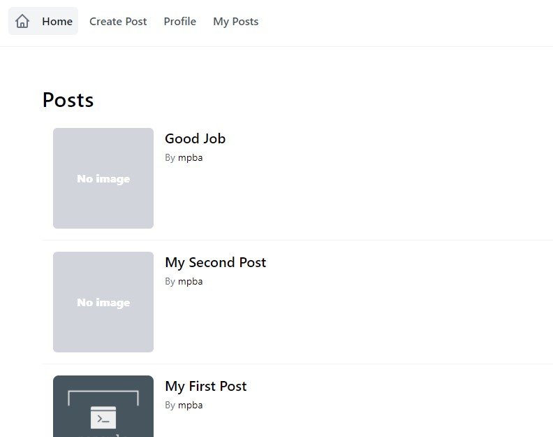

# Full Stack Cloud with Next.js, Tailwind, and AWS


A full stack cloud application with [Next.js](https://nextjs.org/), [Tailwind](https://tailwindcss.com/), & [AWS Amplify](https://docs.amplify.aws/).

<details>
  <summary>App Preview</summary>




</details>

[Demo](https://d35e7xto04m4hv.cloudfront.net/)

### Overview

We'll start from scratch, creating a new Next.js app. We'll then, step by step, use the [Amplify CLI](https://github.com/aws-amplify/amplify-cli) to build out and configure our cloud infrastructure and then use the [Amplify JS Libraries](https://github.com/aws-amplify/amplify-js) to connect the Next.js app to the APIs we create using the CLI.

The app will be a multi-user blogging platform with a markdown editor. When you think of many types of applications like Instagram, Twitter, or Facebook, they consist of a list of items and often the ability to drill down into a single item view. The app we will be building will be very similar to this, displaying a list of posts with data like the title, content, and author of the post.

This is a [Next.js](https://nextjs.org/) project bootstrapped with [`create-next-app`](https://github.com/vercel/next.js/tree/canary/packages/create-next-app).

## Getting Started

First, run the development server:

```bash
npm run dev
# or
yarn dev
```

Open [http://localhost:3000](http://localhost:3000) with your browser to see the result.

You can start editing the page by modifying `pages/index.js`. The page auto-updates as you edit the file.

[API routes](https://nextjs.org/docs/api-routes/introduction) can be accessed on [http://localhost:3000/api/hello](http://localhost:3000/api/hello). This endpoint can be edited in `pages/api/hello.js`.

The `pages/api` directory is mapped to `/api/*`. Files in this directory are treated as [API routes](https://nextjs.org/docs/api-routes/introduction) instead of React pages.

## Learn More

To learn more about Next.js, take a look at the following resources:

- [Next.js Documentation](https://nextjs.org/docs) - learn about Next.js features and API.
- [Learn Next.js](https://nextjs.org/learn) - an interactive Next.js tutorial.

You can check out [the Next.js GitHub repository](https://github.com/vercel/next.js/) - your feedback and contributions are welcome!

## Deploy on Vercel

The easiest way to deploy your Next.js app is to use the [Vercel Platform](https://vercel.com/new?utm_medium=default-template&filter=next.js&utm_source=create-next-app&utm_campaign=create-next-app-readme) from the creators of Next.js.

Check out our [Next.js deployment documentation](https://nextjs.org/docs/deployment) for more details.
